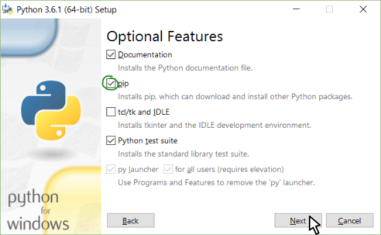

# Robot Framework - Stage 1-0 : เตรียมความพร้อม

สิ่งที่เราจะต้องทำในขั้นตอนนี้คือ การติดตั้ง Python3 และ Pip, การติดตั้ง Dependencies ที่ต้องใช้ และการติดตั้ง Web Driver ที่ต้องการ

## ติดตั้ง Python 3 และ Pip

### Windows (ผ่าน chocolatey)

```
choco install python3
```

เสร็จแล้วก็เพิ่ม ```C:\Python36\;C:\Python36\Scripts\``` ลงใน PATH environment ด้วย

ใครสะดวกใช้ Powershell ก็สั่งคำสั่งนี้ก็ได้ ให้ผลเหมือนกัน

```
[Environment]::SetEnvironmentVariable("Path", "$env:Path;C:\Python36\;C:\Python36\Scripts\", "User")
```

### Windows (ผ่าน Installer)

ระหว่างลง ตรงหน้าจอที่ให้ติ๊กว่าจะเลือกลงอะไรบ้าง ให้ติ๊กที่ Pip ด้วย



### OSX (ผ่าน homebrew)

```
brew install python3
```

### Ubuntu

```
sudo apt-get update
sudo apt-get -y upgrade
sudo apt-get install python3-pip
```

## วิธีตรวจสอบว่าลง Python 3 แล้ว

เปิด Terminal แล้วรันคำสั่ง ```python3 -V``` มันควรจะตอบอะไรประมาณนี้กลับมา

```
Python 3.6.3
```

## วิธีตรวจสอบว่าลง Pip แล้ว

ทำคล้ายกับตอนเช็ค Python คือ เปิด Terminal แล้วรันคำสั่ง ```pip3 -V``` มันควรจะตอบอะไรประมาณนี้กลับมา

```
pip 9.0.1 from /usr/local/lib/python3.6/site-packages (python 3.6)
```

### มันบอกว่า หาคำสั่ง python3 ไม่เจอ

1. ใช้ Windows ใช่ไหม
    * Set PATH หรือยัง ถ้ายัง ไป Set PATH ให้เรียบร้อย
    * Restart Terminal หรือยัง ถ้ายัง Restart Terminal ทีนึงนะ การเปลี่ยนแปลงค่า Environment ใน Windows มันต้อง Restart Terminal มันถึงจะเห็นการเปลี่ยนแปลง
    * ลองเปลี่ยนเป็นคำสั่ง ```python -V``` ดูว่าได้ไหม

### มันขึ้นเป็น python อื่นที่ไม่ได้ install

1. ใช้ Windows ใช่ไหม
    * ลองดูว่าเมื่อกี๊ใช้คำสั่ง ```python3 -V``` หรือ ```python -V```
    * ลองดูว่า PATH ที่ตั้งไว้ มันชี้ไปที่ไหน ชี้ไปคนละที่กับ version ที่เราเพิ่งติดตั้งหรือเปล่า
2. ใช้ OS อื่น ๆ
    * ลองดูว่าเมื่อกี๊ใช้คำสั่ง ```python3 -V``` หรือ ```python -V```
    * ลองดูว่าคำสั่งที่เราเรียก เป็น Symbolic Link ใช่หรือไม่ ถ้าใช่ มันชี้ไปที่ไหน เป็นที่เดียวกับ version ที่เราเพิ่งติดตั้งหรือเปล่า

### มันบอกว่าหาคำสั่ง pip3 ไม่เจอ
1. ใช้ Windows ใช่ไหม
    * ตอนติดตั้งผ่าน GUI ได้เลือกให้ติดตั้ง pip ด้วยหรือเปล่า ถ้าไม่ กลับไปติดตั้งใหม่ แล้วเลือกติดตั้ง pip ด้วย
    * Set PATH หรือยัง ถ้ายัง ไป Set PATH ให้เรียบร้อย
    * Restart Terminal หรือยัง ถ้ายัง Restart Terminal ทีนึงนะ การเปลี่ยนแปลงค่า Environment ใน Windows มันต้อง Restart Terminal มันถึงจะเห็นการเปลี่ยนแปลง
    * ลองเปลี่ยนเป็นคำสั่ง ```python -V``` ดูว่าได้ไหม

## ติดตั้ง Dependencies สำหรับ Robot Framework

รันคำสั่งข้างล่าง เพื่อติดตั้ง Dependencies ที่ต้องใช้ทั้งหมด

```
pip3 install --pre --upgrade -r packages.txt
```

### มันบอกว่าหาไฟล์ชื่อ packages.txt ไม่เจอ?

ดาวน์โหลดไฟล์ packages.txt ที่อยู่ใน repository นี้ไปใช้เลย ในนั้นใส่รายชื่อ dependencies ไว้ให้หมดแล้ว

ดาวน์โหลดเสร็จแล้ว กลับไปติดตั้ง dependencies ใหม่ตามคำสั่งด้านบน

## ติดตั้ง Web Driver

Web Driver จะเป็นตัวกลางระหว่าง Selenium กับ Browser ในเครื่องที่เรา ดาวน์โหลด Web Driver มาวางไว้ใน Path ไหนก็ได้ในเครื่องเรา และเพิ่ม Path นั้นลงไปใน PATH Environment ของเครื่อง

ในคลาสนี้จะใช้ Google Chrome เป็นหลัก ดังนั้น โหลด Chrome Web Driver มาด้วยนะครับ

| Web Driver | Download |
| ---------- | -------- |
| Chrome | https://sites.google.com/a/chromium.org/chromedriver/downloads |
| Firefox | https://github.com/mozilla/geckodriver/releases |

ที่สำคัญคือ เมื่อ Set PATH แล้ว ให้ Restart Browser ด้วย ถ้าเป็น OSX หรือ Ubuntu สามารถ ```source .profile``` ของ shell ได้เลย

## ลองดูว่าติดตั้ง robot ได้ไหม

รันคำสั่ง ```robot --version``` มันจะต้องบอกว่าใช้ robot เวอร์ชั่น 3.x.x กับ python เวอร์ชั่น 3.x.x

ถ้าหากได้ python เวอร์ชั่นอื่น ให้ลองดูในไฟล์ robot (เปิดดูด้วย text editor) ว่าด้านในระบุ python เวอร์ชั่นอะไรอยู่ ก็แก้ให้ถูกต้อง

## ลอง

ลองรันคำสั่ง ```robot welcome.robot``` ดู มันควรจะเปิด Browser และแสดงข้อความต้อนรับออกมา

|   |   |
| - | - |
| [INDEX](../README.md) | [เรื่องถัดไป](../1-1/README.md) |
|   |   |
